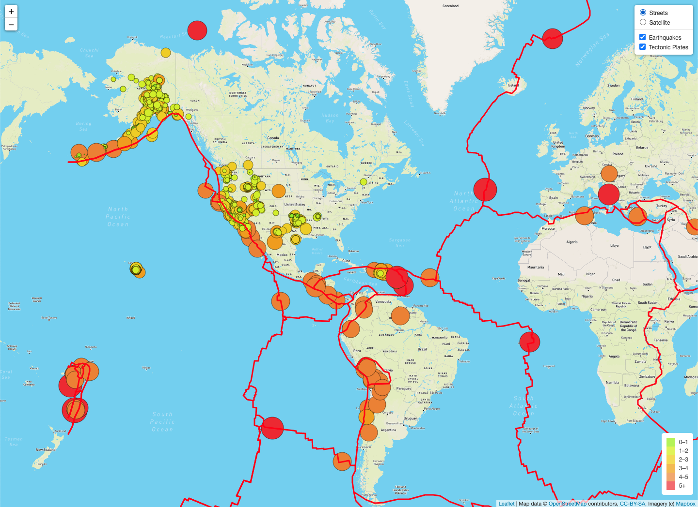
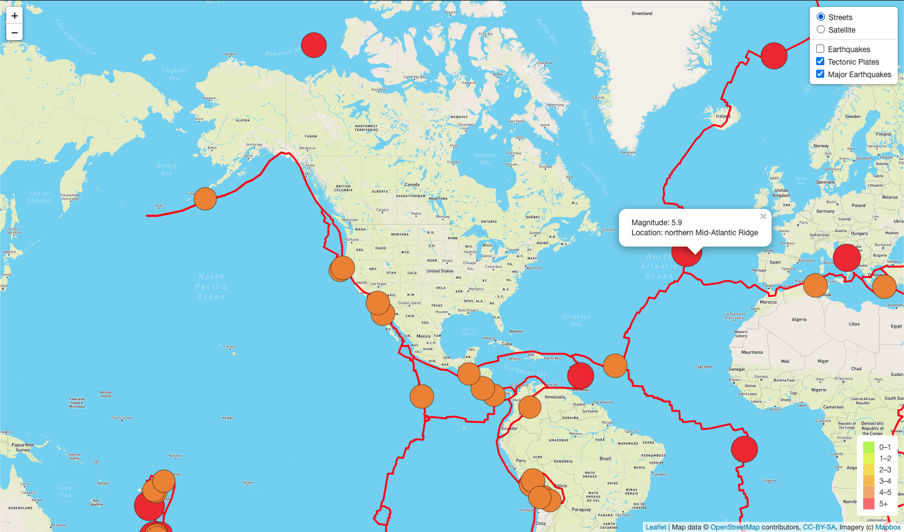
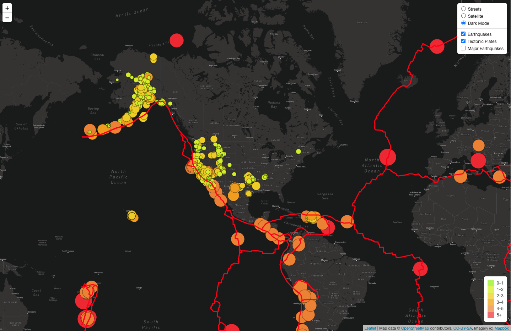

# Mapping Earthquakes

## Overview of Project

### Purpose
Our objective is to pull earthquake data from the USGS website and create an interactive map using JavaScript, D3.js, leaflet.js, and mapbox.

### Resources

- Software: Leaflet 1.7.1, Mapbox GL JS 2.2.0, VS Code, Google Chrome, HTML5, CSS3 
- Data: 
  - [USGS all earthquakes (past 7 days)](https://earthquake.usgs.gov/earthquakes/feed/v1.0/summary/all_week.geojson)
  - [USGS earthquakes M4.5+ (past 7 days)](https://earthquake.usgs.gov/earthquakes/feed/v1.0/summary/4.5_week.geojson)
  - [tectonic plate boundaries](https://raw.githubusercontent.com/fraxen/tectonicplates/master/GeoJSON/PB2002_boundaries.json)

 

## Results

### Tectonic Plates

Here we see the realtionship between the earthquakes from the past 7 days and the tectonic polates:

### Major Earthquakes

When comparing the following image to the previous image we notice that almost all of the magnitude 4.5+ earthquakes occur along major tectonic plate boundaries.

### Additional Map Style

For a final map style, we created a "Dark Mode" map: 

## Summary

### Next Steps

1) We can correlate the major earthquakes with the major tectonic plate boundaries, but is there a way to explain the smaller earthquakes that appear to frequent the southern and western US plus Alaska?
    - Are there minor tectonic plate boundaries that we could map for the USA?
    - Do earthquakes correlate to shale plays in the oil and gas industry?
2) Does type of the plate boundary affect the strength and/or frequency of earthquakes?
    - We could color-code convergent, divergent, and transform boundaries to visually aid our analysis.
3) Are we missing smaller earthquake data from Europe, Canada, and Africa because our data is sourced from a US agency?